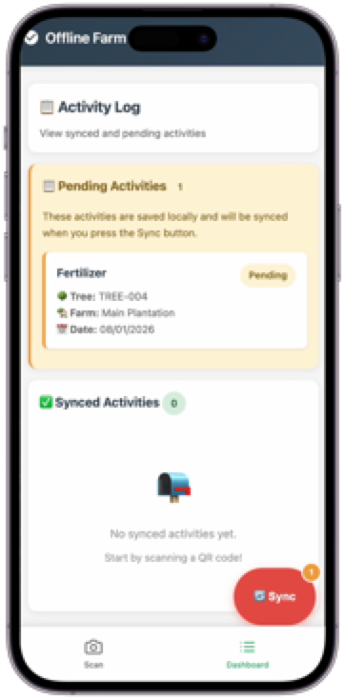

# Farm Management System - Offline Data Capture Demo

A mobile-first web application that enables field workers to record farm activities (fertilizer application, pruning, harvesting) using QR code identification, with full offline capability and manual synchronization.



*Mobile-optimized interface for offline field data capture*

## Solution Overview

This system solves the challenge of capturing field data in remote agricultural locations where internet connectivity is unreliable or unavailable. Field workers can scan QR codes on individual trees/palms, record activities, and sync all data to the server when connectivity is restored.

**Key Problem Solved:** Data loss and workflow interruption in areas with poor connectivity.

**Solution Approach:** Offline-first architecture where all data is captured locally and synchronized on-demand when internet is available.

## Key Features

### Offline-First Data Capture
- Record activities without internet connection
- Data persists even if browser is closed or device restarts
- No data loss when working in remote field locations

### QR Code Identification
- Scan QR codes on trees/palms for instant identification
- Manual entry option if QR scanning is unavailable
- Unique tree IDs ensure accurate activity tracking

### Activity Recording
- **Fertilizer Application**: Track fertilizer type, quantity, and application date
- **Pruning**: Record pruning activities with notes
- **Harvesting**: Log harvest dates and quantities
- **Custom Activities**: Flexible option for any other field activity

### Manual Synchronization
- One-button sync when internet is available
- Visual distinction between pending (local) and synced (server) activities
- Automatic sync when connection is restored
- Clear feedback on sync status

### Mobile-Optimized Interface
- Designed for mobile devices used in the field
- Large touch targets for easy interaction
- Responsive design works on all screen sizes
- Camera-based QR scanning

## Architecture Overview

The system uses a **three-layer architecture**:

1. **Client Layer (Browser)**: Mobile web app that works offline
   - Stores data locally in browser storage
   - Provides QR scanning and activity forms
   - Handles synchronization with server

2. **Service Layer (Server)**: Django web application
   - Receives and stores synced activities
   - Provides tree lookup and activity history
   - Manages farm and tree master data

3. **Data Layer**: SQLite database
   - Stores farms, trees, and activity records
   - Simple file-based storage for easy deployment

**Data Flow:**
- Activities are captured → Saved locally → Queued for sync → Uploaded to server when online

## User Workflow

### For Field Workers

1. **Setup** (One-time, by administrator)
   - Create farms and trees in admin panel
   - Generate QR codes for each tree ID
   - Print and attach QR codes to trees

2. **Recording Activities**
   - Open the app on mobile device
   - Navigate to "Scan QR" page
   - Scan QR code or enter tree ID manually
   - Select activity type (Fertilizer, Pruning, Harvesting, Other)
   - Enter date, quantity (optional), and notes (optional)
   - Save activity (stored locally, works offline)

3. **Synchronizing Data**
   - Navigate to "Dashboard" page
   - View pending activities (yellow badge) - not yet on server
   - View synced activities (green badge) - successfully uploaded
   - When internet is available, click "Sync" button
   - Pending activities are uploaded and moved to "Synced"

### For Administrators

- Access Django admin panel to manage farms and trees
- View all synced activities in the database
- Export data for reporting and analysis

## Technical Architecture

### High-Level System Design

```
┌─────────────────────────────────────────────────────────┐
│                    Mobile Browser                        │
│  ┌──────────────┐  ┌──────────────┐  ┌──────────────┐ │
│  │   QR Scanner │  │ Activity Form│  │  Dashboard   │ │
│  └──────┬───────┘  └──────┬───────┘  └──────┬───────┘ │
│         │                 │                  │          │
│         └─────────────────┼──────────────────┘          │
│                           │                             │
│                  ┌────────▼────────┐                    │
│                  │  localStorage   │                    │
│                  │  (Offline Data) │                    │
│                  └────────┬────────┘                    │
└───────────────────────────┼─────────────────────────────┘
                            │
                    ┌───────▼────────┐
                    │  Service Worker│
                    │  (Offline Cache)│
                    └───────┬────────┘
                            │
                    ┌───────▼────────┐
                    │  Django Server │
                    │  (REST API)    │
                    └───────┬────────┘
                            │
                    ┌───────▼────────┐
                    │  SQLite DB     │
                    │  (Data Store)  │
                    └────────────────┘
```

### Technology Stack

- **Frontend**: HTML5, CSS3, JavaScript (Vanilla)
- **Backend**: Django 4.2 (Python web framework)
- **Database**: SQLite (file-based, no separate server needed)
- **Offline Storage**: Browser localStorage + Service Worker
- **QR Scanning**: jsQR library + device camera API

### Offline Capability Implementation

The system achieves true offline functionality through:

1. **Service Worker**: Caches web pages and assets for offline access
2. **localStorage**: Stores pending activities locally in browser
3. **API Response Caching**: Caches tree lookups and synced activities
4. **Network Detection**: Automatically syncs when connection is restored

## Setup & Installation

### Prerequisites

- Python 3.8 or higher
- pip (Python package manager)
- Modern web browser with camera access (for QR scanning)

### Installation Steps

1. **Navigate to project directory**
   ```bash
   cd farm_management
   ```

2. **Create virtual environment** (recommended)
   ```bash
   python3 -m venv .venv
   source .venv/bin/activate  # On Windows: .venv\Scripts\activate
   ```

3. **Install dependencies**
   ```bash
   pip install -r requirements.txt
   ```

4. **Run database migrations**
   ```bash
   python manage.py migrate
   ```

5. **Create sample data** (optional)
   ```bash
   python manage.py shell
   ```
   Then run:
   ```python
   from farm_app.models import Farm, Tree
   farm = Farm.objects.create(name="Main Plantation", location="North Field")
   Tree.objects.create(farm=farm, tree_id="TREE-001")
   Tree.objects.create(farm=farm, tree_id="TREE-002")
   ```

6. **Start development server**
   ```bash
   python manage.py runserver
   ```

7. **Access the application**
   - Open browser: `http://localhost:8000`
   - No login required - start using immediately

### Admin Access

To manage farms and trees:

1. Create superuser:
   ```bash
   python manage.py createsuperuser
   ```

2. Access admin panel: `http://localhost:8000/admin`

## Technical Details

### Project Structure

```
farm_management/
├── manage.py                 # Django management script
├── requirements.txt          # Python dependencies
├── db.sqlite3               # SQLite database (created after migration)
│
├── farm_management/          # Django project configuration
│   ├── settings.py          # Application settings
│   ├── urls.py              # Root URL configuration
│   └── wsgi.py              # WSGI application entry point
│
└── farm_app/                 # Main application module
    ├── models.py             # Data models (Farm, Tree, Activity)
    ├── views.py              # Request handlers and API endpoints
    ├── urls.py               # Application URL routing
    ├── admin.py              # Django admin configuration
    │
    ├── static/               # Static files (CSS, JS, images)
    │   └── farm_app/
    │       └── service-worker.js  # Offline caching service worker
    │
    └── templates/            # HTML templates
        └── farm_app/
            ├── base.html     # Base template with navigation
            ├── dashboard.html    # Activity dashboard
            └── scan.html     # QR scanning and activity form
```

### Data Models

**Farm**: Represents a farm or plantation
- Fields: name, location, created_at

**Tree**: Represents an individual tree/palm with unique QR identifier
- Fields: farm (foreign key), tree_id (unique), created_at

**Activity**: Records field activities
- Fields: tree (foreign key), activity_type, date, quantity, notes, custom_type, created_at

### API Endpoints

| Endpoint | Method | Description |
|----------|--------|-------------|
| `/` | GET | Dashboard page (shows activities) |
| `/scan/` | GET | QR scan and activity capture page |
| `/api/sync/` | POST | Sync pending activities to server |
| `/api/tree/<tree_id>/` | GET | Get tree information by ID |
| `/api/synced-activities/` | GET | Get all synced activities as JSON |

### Offline Storage Strategy

**localStorage Keys:**
- `farm_activities_pending`: Array of pending activities (not yet synced)
- `farm_activities_synced`: Cached synced activities (for offline viewing)
- `tree_<tree_id>`: Cached tree lookup responses

**Service Worker Caching:**
- Caches HTML pages for offline access
- Caches API responses (GET requests only)
- Does not cache POST requests (sync operations)

### Synchronization Flow

1. User records activity → Saved to `localStorage` as pending
2. User clicks "Sync" button → POST request to `/api/sync/`
3. Server validates and saves activities → Returns success count
4. Client clears pending activities from `localStorage`
5. Client reloads synced activities from server
6. UI updates to show activities as "Synced"

### Error Handling

- **Offline Detection**: Visual indicator when offline
- **Sync Failures**: Clear error messages, activities remain in pending
- **Network Timeouts**: 15-second timeout with user feedback
- **Invalid Data**: Server validation with error reporting

## Browser Compatibility

- **Chrome/Edge**: Full support (recommended)
- **Safari**: Full support (iOS 11.3+)
- **Firefox**: Full support
- **Mobile Browsers**: Full support with camera access

**Required Browser Features:**
- localStorage API
- Service Worker API
- Camera API (for QR scanning)
- Fetch API

## Limitations & Considerations

This is a **functional demo** designed to showcase offline data capture capabilities. For production use, consider:

- **Authentication**: Currently no user authentication (demo only)
- **Data Validation**: Enhanced server-side validation
- **Conflict Resolution**: Strategy for handling concurrent edits
- **Storage Limits**: localStorage has ~5-10MB limit (consider IndexedDB for larger datasets)
- **Security**: Add HTTPS, input sanitization, rate limiting
- **Scalability**: SQLite suitable for small-medium deployments; consider PostgreSQL for larger scale

## License

**Copyright (c) 2024**

All rights reserved. This software and associated documentation files (the "Software") are proprietary and confidential.

This Software is provided for demonstration and evaluation purposes only. Unauthorized copying, modification, distribution, or use of this Software, via any medium, is strictly prohibited without express written permission.

The Software is provided "AS IS", without warranty of any kind, express or implied, including but not limited to the warranties of merchantability, fitness for a particular purpose and noninfringement. In no event shall the authors or copyright holders be liable for any claim, damages or other liability, whether in an action of contract, tort or otherwise, arising from, out of or in connection with the Software or the use or other dealings in the Software.

---

*This project is a demonstration of offline-first data capture capabilities for farm management systems.*
